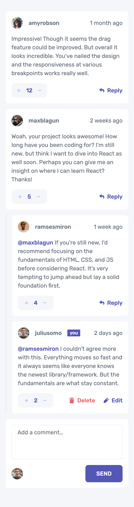
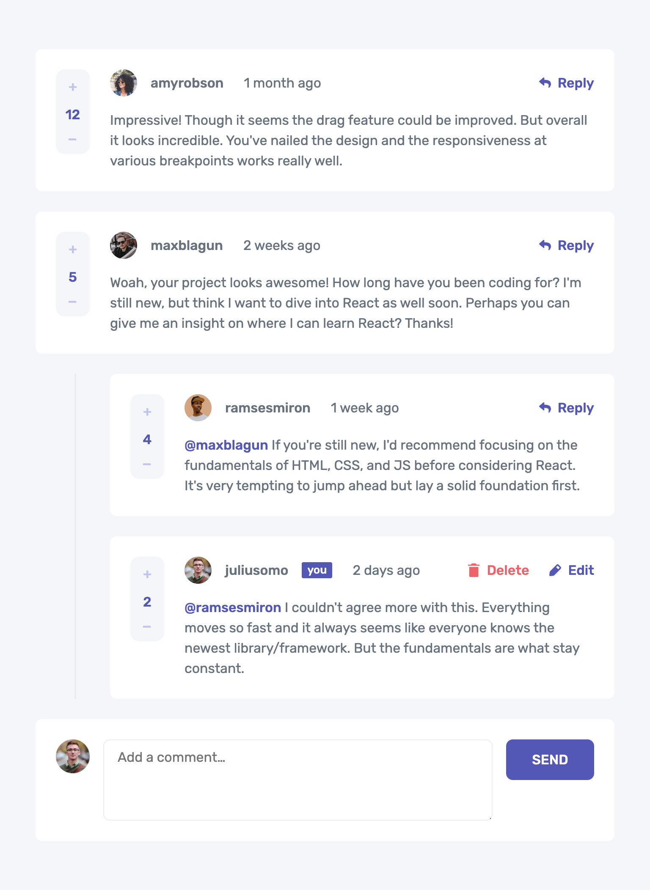
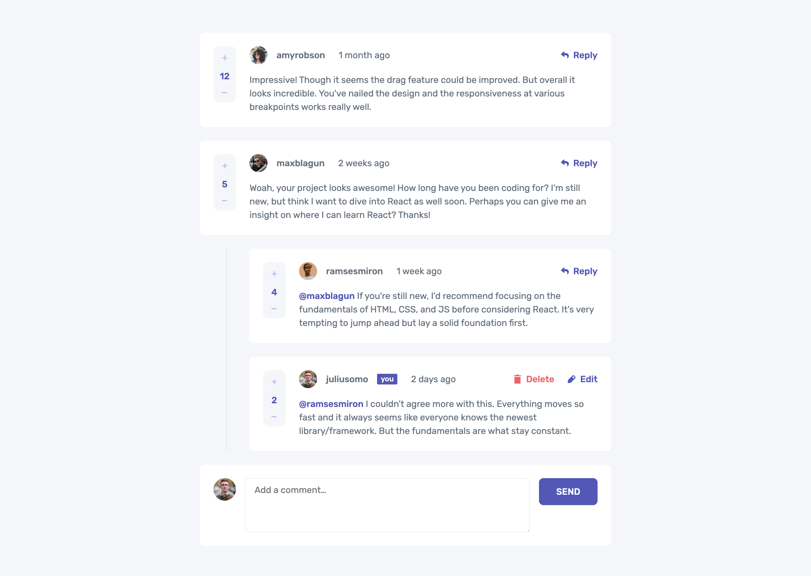

# Frontend Mentor - Interactive comments section solution

This is a solution to the [Interactive comments section challenge on Frontend Mentor](https://www.frontendmentor.io/challenges/interactive-comments-section-iG1RugEG9). Frontend Mentor challenges help you improve your coding skills by building realistic projects.

I am completing this challenge as part of the [Introduction to front-end testing](https://www.frontendmentor.io/learning-paths/introduction-to-front-end-testing-kacF_IJQO5) Frontend Mentor learning path. This continues my efforts to learn my chosen JS Framework - [Vue.js](https://vuejs.org/) + [Pinia](https://pinia.vuejs.org/). And now my more specific goal for this challenge was to learn to incorporate [integration tests](https://www.frontendmentor.io/learning-paths/introduction-to-front-end-testing-kacF_IJQO5/steps/689e5149d98fffca3e5870a4/article/read).

## Table of contents

- [Overview](#overview)
  - [The challenge](#the-challenge)
  - [Screenshots](#screenshots)
  - [Links](#links)
- [My process](#my-process)
  - [Built with](#built-with)
  - [What I learned](#what-i-learned)
  - [Continued development](#continued-development)
  - [Useful resources](#useful-resources)
- [Author](#author)

## Overview

### The challenge

Users should be able to:

- View the optimal layout for the app depending on their device's screen size
- See hover states for all interactive elements on the page
- Create, Read, Update, and Delete comments and replies
- Upvote and downvote comments
- **Bonus**: If you're building a purely front-end project, use `localStorage` to save the current state in the browser that persists when the browser is refreshed.
- **Bonus**: Instead of using the `createdAt` strings from the `data.json` file, try using timestamps and dynamically track the time since the comment or reply was posted.

### Expected behaviour

- First-level comments should be ordered by their score, whereas nested replies are ordered by time added.
- Replying to a comment adds the new reply to the bottom of the nested replies within that comment.
- A confirmation modal should pop up before a comment or reply is deleted.
- Adding a new comment or reply uses the `currentUser` object from within the `data.json` file.
- You can only edit or delete your own comments and replies.

### Screenshots

|        Mobile designed at 375px:         |        Tablet designed at 1440px:        | Desktop designed at 1440px:               |
| :--------------------------------------: | :--------------------------------------: | ----------------------------------------- |
|  |  |  |

### Links

- Solution URL: [https://github.com/elisilk/interactive-comments-section](https://github.com/elisilk/interactive-comments-section)
- Live Site URL: [https://elisilk.github.io/interactive-comments-section/](https://elisilk.github.io/interactive-comments-section/)

## My process

### Built with

- Semantic HTML5 markup
- CSS custom properties
- Flexbox
- CSS Grid
- Mobile-first workflow
- Accessibility
- [Vite](https://vite.dev/)
- [Vue](https://vuejs.org/)
- [Pinia](https://pinia.vuejs.org/)
- [Vitest](https://vitest.dev/guide/)
- [Vue Test Utils](https://test-utils.vuejs.org/guide/)

### What I learned

As always, so many cool :sunglasses: things. Here are some of the key resources I used.

#### Testing the App

- General Integration Testing Resources (not specifically for Vue)
  - [Frontend Mentor > Learning Path > Integration Tests](https://www.frontendmentor.io/learning-paths/introduction-to-front-end-testing-kacF_IJQO5/steps/689e5149d98fffca3e5870a4/article/read)
  - [How To Write Integration Tests With Jest And React Testing Library](https://coderpad.io/blog/development/how-to-write-integration-tests-with-jest-and-react-testing-library/)
  - [End-to-end vs integration tests: what's the difference?](https://www.onpathtesting.com/blog/end-to-end-vs-integration-testing)
  - [Write tests. Not too many. Mostly integration.](https://kentcdodds.com/blog/write-tests)
- [Pinia > Testing stores](https://pinia.vuejs.org/cookbook/testing.html)
- Vue Test Utils
  - [API Reference](https://test-utils.vuejs.org/api/)
  - [Event Handling](https://test-utils.vuejs.org/guide/essentials/event-handling.html)
  - [Form Handling](https://test-utils.vuejs.org/guide/essentials/forms.html)

#### Building the App

- Vue
  - [List Rendering](https://vuejs.org/guide/essentials/list)
  - [Slots](https://vuejs.org/guide/components/slots.html)
  - [Props](https://vuejs.org/guide/components/props)
  - [Class and Style Bindings​](https://vuejs.org/guide/essentials/class-and-style)
  - [Component Events](https://vuejs.org/guide/components/events)
  - [Watchers](https://vuejs.org/guide/essentials/watchers.html)
- Vue Transitions
  - [Vue > TransitionGroup](https://vuejs.org/guide/built-ins/transition-group.html)
  - [Vue Examples > List with Transition](https://vuejs.org/examples/#list-transition)
- [`<textarea>`: The Textarea element](https://developer.mozilla.org/en-US/docs/Web/HTML/Reference/Elements/textarea)
- Composable - A single, reusable confirmation dialog
  - [Composables](https://vuejs.org/guide/reusability/composables)
  - [Teleport](https://vuejs.org/guide/built-ins/teleport)
  - [How can I use a composable for an alert/confirmation component?](https://www.reddit.com/r/vuejs/comments/x9847l/how_can_i_use_a_composable_for_an/)
  - [Junior vs Senior: Building Modals in Vue](https://michaelnthiessen.com/junior-vs-senior-modals)
- Dialog
  - [`<dialog>`: The Dialog element](https://developer.mozilla.org/en-US/docs/Web/HTML/Reference/Elements/dialog)
  - [HTMLDialogElement: returnValue property](https://developer.mozilla.org/en-US/docs/Web/API/HTMLDialogElement/returnValue)
- [CRUD (create, read, update, delete)](https://en.wikipedia.org/wiki/Create,_read,_update_and_delete)
  - [Vue Examples > CRUD](https://vuejs.org/examples/#crud)
  - Searching the comments data
    - [How to find a object in a nested array using recursion in JS](https://stackoverflow.com/questions/53390440/how-to-find-a-object-in-a-nested-array-using-recursion-in-js)
    - [Array.prototype.reduce()](https://developer.mozilla.org/en-US/docs/Web/JavaScript/Reference/Global_Objects/Array/reduce)
  - Create
    - [How do I recursively find the highest number in a deeply nested array of objects](https://stackoverflow.com/questions/75763180/how-do-i-recursively-find-the-highest-number-in-a-deeply-nested-array-of-objects)
    - [Deep copy](https://developer.mozilla.org/en-US/docs/Glossary/Deep_copy)
  - Read
  - Update
  - Delete
    - [Array.prototype.splice()](https://developer.mozilla.org/en-US/docs/Web/JavaScript/Reference/Global_Objects/Array/splice)
- Nested arrays
  - [JavaScript: Difference between .forEach() and .map()](https://stackoverflow.com/questions/34426458/javascript-difference-between-foreach-and-map)
  - [Array > Iterative methods](https://developer.mozilla.org/en-US/docs/Web/JavaScript/Reference/Global_Objects/Array#iterative_methods)
  - [Array.prototype.forEach()](https://developer.mozilla.org/en-US/docs/Web/JavaScript/Reference/Global_Objects/Array/forEach)
  - [Array.prototype.map()](https://developer.mozilla.org/en-US/docs/Web/JavaScript/Reference/Global_Objects/Array/map)
- Relative timestamps
  - [Fast and Light Relative Time Strings in JS](https://www.builder.io/blog/relative-time)
  - [Intl.RelativeTimeFormat](https://developer.mozilla.org/en-US/docs/Web/JavaScript/Reference/Global_Objects/Intl/RelativeTimeFormat)
  - [Date](https://developer.mozilla.org/en-US/docs/Web/JavaScript/Reference/Global_Objects/Date)
  - [Date and time](https://javascript.info/date)
- Matching and trimming the @username
  - [String.prototype.match()](https://developer.mozilla.org/en-US/docs/Web/JavaScript/Reference/Global_Objects/String/match)
  - [Regular expression tester](https://regex101.com/r/1O1CBv/1)
  - [Regular expressions](https://javascript.info/regular-expressions)
- [Pinia state and local storage with $subscribe](https://pinia.vuejs.org/core-concepts/state.html#Subscribing-to-the-state)

### Continued development

Specific areas that the solution should be improved (known issues):

- [x] Don't immediately give focus to the default add new comment textarea (unlike the conditional reply textareas, which should automatically get focus)
  - Solved this using Vue's [Custom Directives](https://vuejs.org/guide/reusability/custom-directives). Very cool. :sunglasses:
- [ ] Add in error checking/validation.
  - For example, should the store enforce that a new comment can be added only if there is a current
  - And should an update or deletion only be made if the current user matches the author of the comment to be updated or deleted?
- [ ] Make sure form and input element ids are each unique (especially if reusing components in different places, under different conditions). For example, do the new comment creation form and textarea inputs have unique ids compared to ones that are created for replying to a post?
- [ ] In comment user component, if only showing the image (`format='image-only'`), include the username as 'sr-only' rather than excluding it entirely.
- [ ] Consider using container queries to make layout adjustments rather than media queries
- [ ] Think more about whether there should be a limit to how nested the replies can be. Or at least how nested the formatting can get, especially in narrower viewport widths.
- [ ] Think about combining the editing of an existing comment with the new comment into a common component (or components)

Specific enhancements I'd like to make (feature requests):

- [ ] ...

More general ideas I want to consider:

Hmm 🤔 ...

- Learn and use [TypeScript](https://www.typescriptlang.org/)
- Implement a full-stack app

### Useful resources

- [Vue Guide](https://vuejs.org/guide/)
- [Pinia Guide](https://pinia.vuejs.org/core-concepts/)
- [Vite Guide](https://vite.dev/guide/)
- [MDN Web Docs for CSS](https://developer.mozilla.org/en-US/docs/Web/CSS) - Went here a lot to reference the different CSS properties and the shorthands, and all the great explanations about best practices.

## Author

- Website - [Eli Silk](https://github.com/elisilk)
- Frontend Mentor - [@elisilk](https://www.frontendmentor.io/profile/elisilk)
